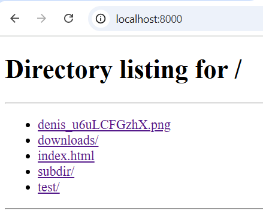
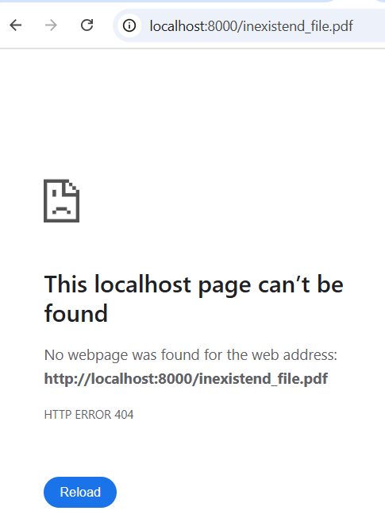
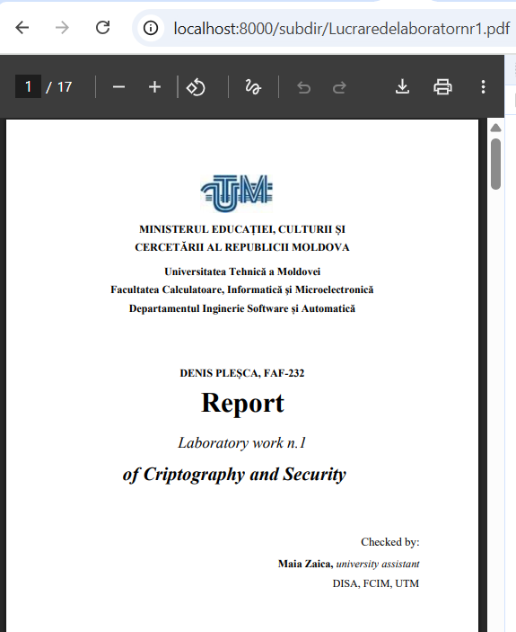
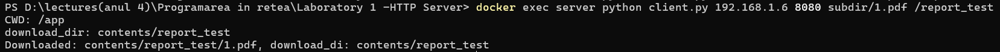
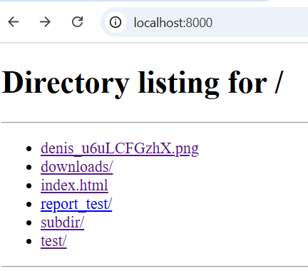
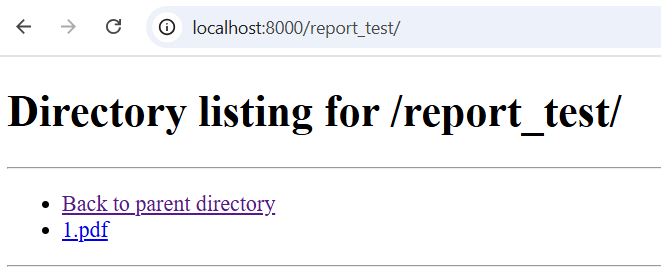
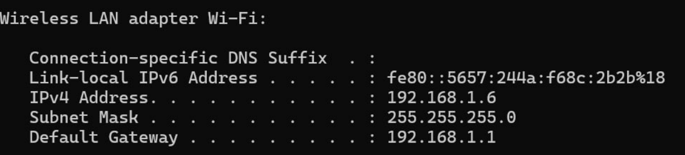
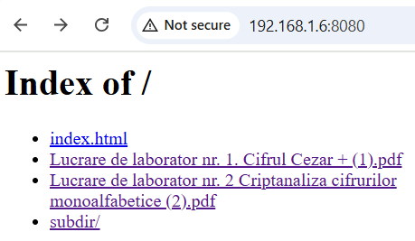

# Laboratory Report: HTTP Server & Client

## 1. Source Directory

The source directory consists of two files [server\.py](https://github.com/Dackohn/HTTP-server/blob/master/src/server.py) that is responsible for all the web server stuff, receiving requests and responding to them and a [client\.py](https://github.com/Dackohn/HTTP-server/blob/master/src/client.py) that initiates the comunication and the requests, as well as downloading fileas and printing the contents of html files.
### [Source Directory](https://github.com/Dackohn/HTTP-server/tree/master/src)

## 2. Docker Compose & Dockerfile

The docker compose and dockerfile are really straight forward for this laboratory work only copying the necesary server and client files into the container as well as mounting the repository that is meant to be visible on the web page.

### [Docker Compose](https://github.com/Dackohn/HTTP-server/blob/master/docker-compose.yml)

### [Dockerfile](https://github.com/Dackohn/HTTP-server/blob/master/Dockerfile)

---

## 3. Starting the Container

The container is started by simply running the command ```docker compose up --build -d```

{: width=300}

---

## 4. Running the Server

The command that is use to run the server is ```python server.py <served_directory>```. The current docker_compose runs the command automaticaly when the container is created:
{: width=300}

## 5. Contents of the Served Directory

Accessing the main endpoint of the server displays all files and folders in the served directory, sorted alphabetically, as shown in the image below:
{: width=300}

## 6. Accesing different types of files
### 404 Error
This screenshot demonstrates the server's response when attempting to access a file that does not exist. The server correctly returns a 404 Not Found error.
{: width=300}

### HTML File with Image
This screenshot shows how the server serves an HTML file containing an embedded image. The page is rendered correctly in the browser, displaying both the HTML content and the image.
{: width=300}

### PDF File
This image illustrates the server delivering a PDF file. The PDF is accessible and can be opened or downloaded by the client.
{: width=300}

### PNG File
This screenshot shows the server serving a PNG image. The image loads correctly in the browser, demonstrating proper handling of binary file types.
{: width=300}

## 7. Running the client
The command that is used to run the client is ```python client.py <target_ip> <target_port> <target_file> <download_directory>```. The command output in the terminal looks like this:


The file together with the missing folder where succesfuly created:
{: width=300}


## 7. Running the client
The command that is used to run the client is ```python client.py <target_ip> <target_port> <target_file> <download_directory>```. The command output in the terminal looks like this:


The file together with the missing folder where succesfuly created:
{: width=300}

## 8. Directory listing
For this section we will review the page generated for the repository *report_test* from the last section that has the file dowloaded as well as an button to return to the home page:

{: width=300}

## 9. Accessing a Friend’s Server on the Local Network

In this part of the experiment, I connected to a friend’s HTTP server hosted on the same local network.

To establish the connection, I first determined their local IP address using the `ipconfig` command . The server was accessible at the IP address `192.168.1.6` on port `8080` as seen in the image:
{: width=300}

I then used our custom client to send requests directly to the server:
```python client.py 192.168.1.6 8080 subdir/1.pdf /report_test```


This allowed us to successfully retrieve files hosted on their machine.

The following screenshots show:
- The contents of the friend’s served directory.
- Successful requests made to their server using our client.
- The files downloaded and saved locally on our machine.

{: width=300}

The subdirectory create:

{: width=300}

As well as the file in it:

{: width=300}
{: width=300}


---

## 10. Conclusion

Throughout this laboratory work, we successfully implemented and tested a minimal HTTP server and client using Python sockets, both running inside Docker containers. The server correctly handled various types of requests, including HTML, PDF, PNG, and invalid file paths, returning appropriate responses such as the 404 error when necessary.

The Docker environment ensured a consistent and isolated setup, with both the server and client operating reliably across different configurations. Additionally, directory listings were generated dynamically, providing navigable links to files and subdirectories.

The client program proved capable of connecting to both local and remote servers within the same network, demonstrating successful file downloads and HTML content retrieval. Overall, the experiment verified a clear understanding of HTTP request–response mechanics, socket communication, and containerized deployment.

This laboratory provided a solid foundation in network programming and web communication principles, emphasizing both practical implementation and interoperability within a Docker-based environment.

