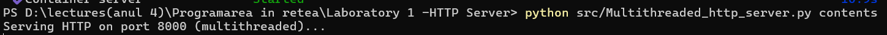
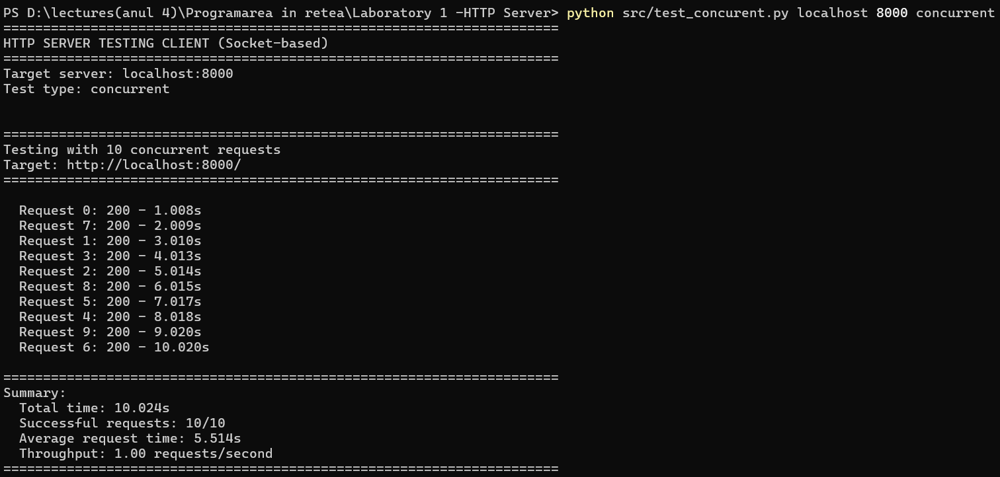
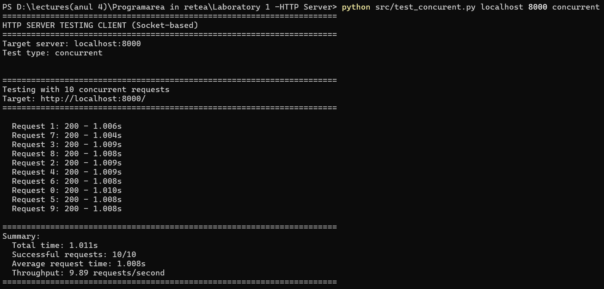
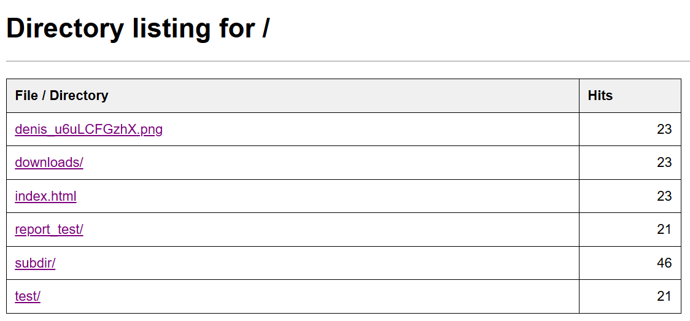
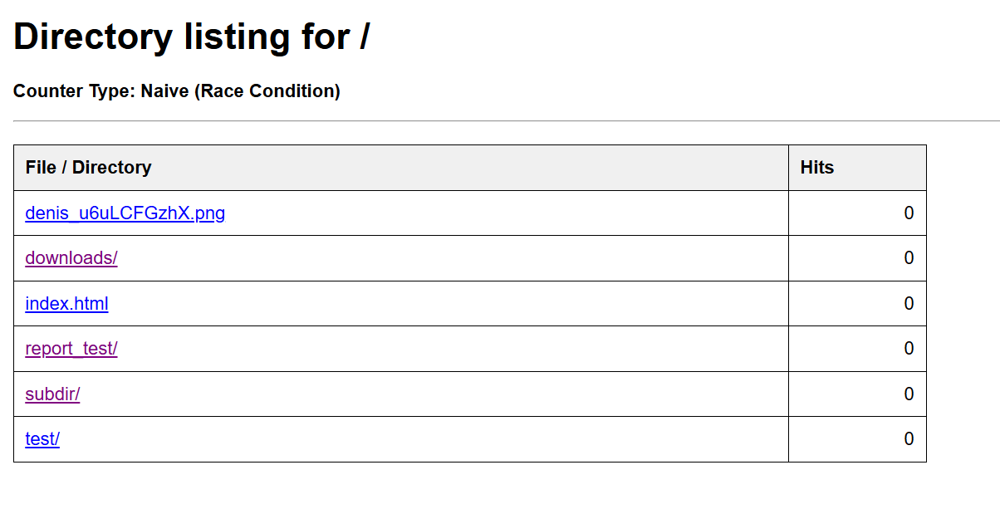
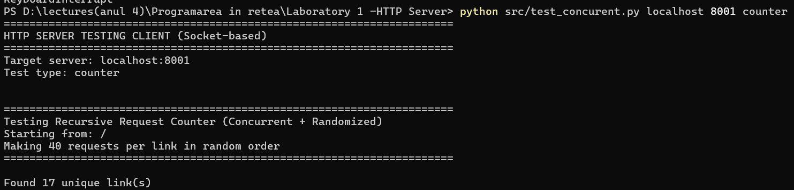
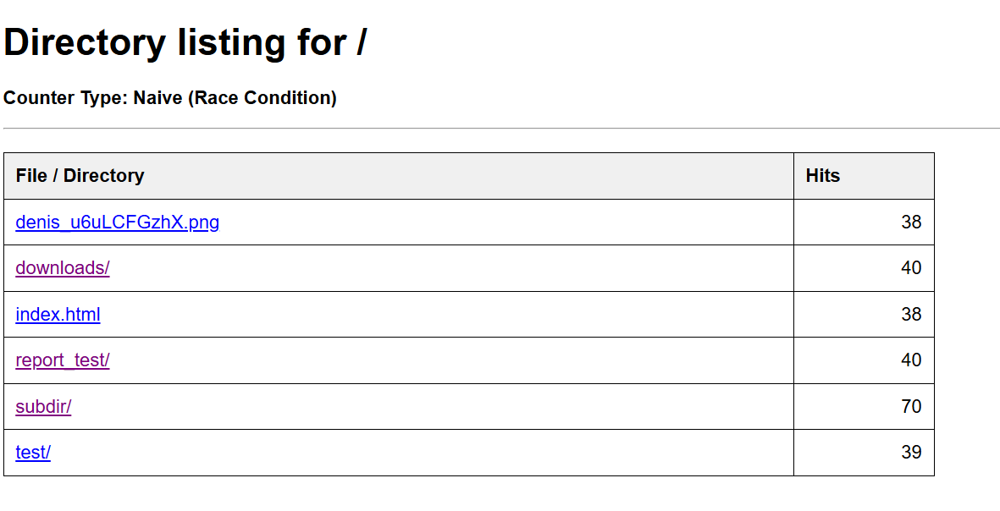
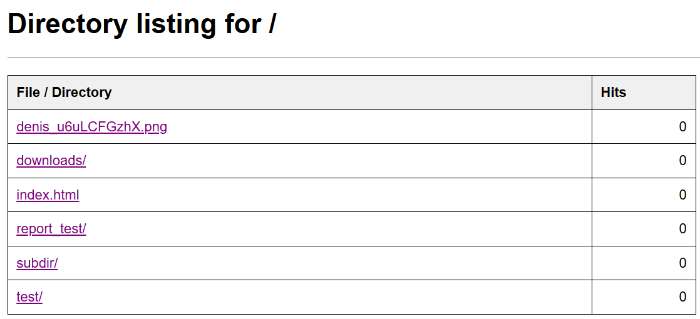
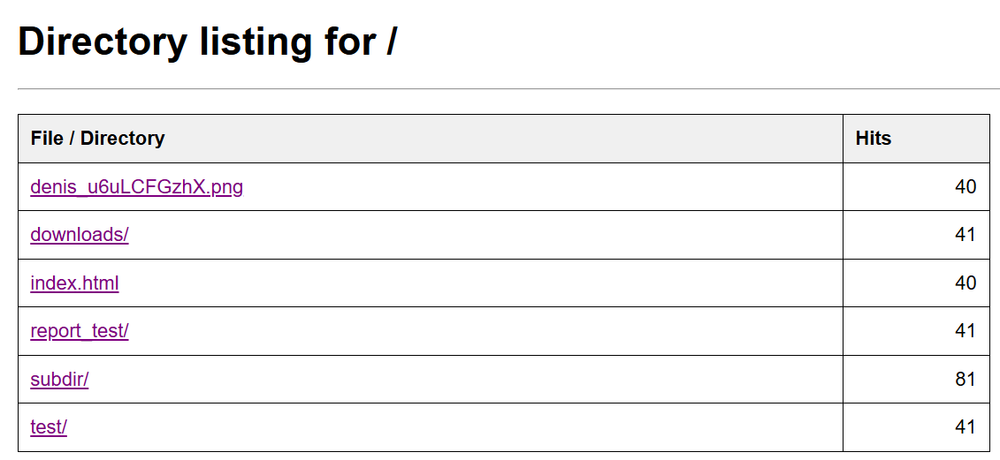
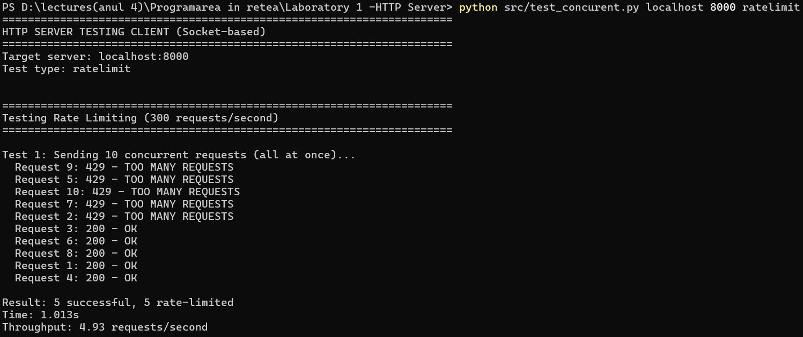

# Laboratory Report: Multithreaded HTTP Server

## 1. Source Directory

The source directory consists of three main files:
- [Multithreaded_http_server.py](src/Multithreaded_http_server.py) - The main multithreaded HTTP server implementation with request handling, rate limiting, and request counting features
- [test_concurrent.py](src/test_concurent.py) - A comprehensive testing client that validates concurrent request handling, rate limiting, request counters, and includes random navigation testing
- [test_without_lock.py](src/test_without_lock.py) - A demonstration server showing the race condition problem and its solution using locks

### [Source Directory](src/)

---

## 2. Docker Compose & Dockerfile

The Docker configuration files handle the containerization of the multithreaded HTTP server, copying necessary server and testing scripts into the container and mounting the directory to be served.

### [Docker Compose](docker-compose.yml)

### [Dockerfile](Dockerfile)

---

## 3. Starting the Container

The container is started using the command: `docker compose up --build -d`

---

## 4. Running the Multithreaded Server

The server is started with the command: `python Multithreaded_http_server.py <served_directory>`

The server runs on port 8000 and handles multiple concurrent connections using threading.



---

## 5. Concurrency Testing

### 5.1 Single-threaded vs Multithreaded Performance

To demonstrate the benefits of multithreading, we compare request handling times between single-threaded and multithreaded implementations.

**Test Setup:**
- 10 concurrent requests to the server
- 1-second artificial delay added to each request handler
- Measuring total execution time

#### Single-threaded Server Results



Expected time: ~10 seconds (sequential processing)

#### Multithreaded Server Results



Expected time: ~1-2 seconds (threading processing)

---

## 6. Request Counter Implementation

The server implements a request counter that tracks the number of times each file or directory has been accessed.

### 6.1 Directory Listing with Counters



The directory listing displays:
- File/directory names as clickable links
- Hit counter for each item
- Back to parent directory link

---

## 7. Race Condition Demonstration

### 7.1 Naive Implementation (Without Locks)

First, we demonstrate the race condition by implementing a counter without proper synchronization.

**Running the naive server:**
```bash
python test_without_lock.py <directory>
```

#### Testing the Race Condition
The initial counters are all set to 0 and there will be made 40 requests to each file except subdir wich will receive twice as much:



Running concurrent requests using the test client:



**Expected behavior:** Counter shows incorrect values due to race conditions



**Analysis:**
- Expected counter value after 40 requests: 40 + 1 for directories because of file lookup (except subdir/ with 80 because it is called in the index.html)
- Actual counter value: Less than 40
- Reason: Multiple threads reading and writing the counter simultaneously without synchronization

### 7.2 Thread-Safe Implementation (With Locks)

Now we implement the counter with proper lock-based synchronization.

**Running the safe server:**
```bash
python Multithreaded_http_server.py <directory>
```



#### Testing the Fixed Implementation


**Expected behavior:** Counter shows correct values with no lost updates



**Analysis:**
- Expected counter value: 40(+1 for directories because of file lookup)
- Actual counter value: 40 (accurate)
- Reason: Lock ensures atomic read-modify-write operations

---

## 8. Rate Limiting Implementation

The server implements rate limiting to prevent abuse by limiting requests to 300 requests per second per client IP.

### 8.1 Rate Limiting Configuration

```python
RATE_LIMIT = 5  # requests per second
```

The rate limiter tracks request timestamps for each IP address and rejects requests exceeding the limit with HTTP 429 status code.

### 8.2 Testing Rate Limiting

#### Test 1: Rapid Fire Requests (Exceeding Limit)
`python test_concurent.py localhost 8000 ratelimit`



**Expected behavior:** Initial requests succeed, subsequent requests receive 429 Too Many Requests

## 11. Concurrency Concepts Analysis

### 11.1 Parallelism vs Concurrency (PLT Tradition)

In this implementation:

**Concurrency:** The server is structured as a concurrent program with independent request handlers that can operate independently. This is a program structure/design concept.

**Parallelism:** When running on multi-core hardware, request handlers execute truly simultaneously on different CPU cores. This is a hardware execution concept.

**Key observation:** Our concurrent design enables parallel execution, but they remain orthogonal concepts—the concurrent structure exists regardless of whether parallel hardware is available.

### 11.2 Synchronization Mechanisms

**Race Condition:** Occurs when multiple threads access shared data (request counter) without proper coordination, leading to lost updates.

**Critical Section:** The counter increment operation (read-modify-write) is a critical section that must be protected.

**Lock (Mutex):** Used to ensure mutual exclusion—only one thread can execute the critical section at a time, preventing race conditions.

### 11.3 Thread Safety

**Thread-safe operations:**
- Counter increments (with lock)
- Rate limiting checks (with lock)
- Request handling (each request has isolated data)

**Why locks are necessary:**
- Python's GIL doesn't protect against race conditions in composite operations
- Increment operation (read, add, write) is non-atomic
- Multiple threads interleaving these operations cause data corruption

---

## 12. Conclusion

Throughout this laboratory work, we successfully implemented and tested a multithreaded HTTP server with advanced features including request counting and rate limiting. The implementation demonstrates clear understanding of concurrent programming principles following the PLT (Programming Language Theory) tradition, where concurrency is a structural program design concept and parallelism is a hardware execution concept.

The multithreaded server showed significant performance improvements over the single-threaded version, reducing response time for concurrent requests from approximately 10 seconds to 1-2 seconds when handling 10 simultaneous requests.

The race condition demonstration clearly illustrated the dangers of unsynchronized access to shared resources. The naive implementation without locks showed lost counter updates, while the thread-safe implementation with locks maintained accurate counts even under heavy concurrent load. This validated the necessity of proper synchronization mechanisms in multithreaded applications.

The rate limiting feature successfully protected the server from request spam while maintaining fairness through per-IP tracking. The implementation demonstrated thread-safe rate limiting that correctly enforced the 300 requests/second limit without affecting legitimate users.

The comprehensive testing suite validated all aspects of the implementation, including concurrent request handling, counter accuracy under various access patterns, rate limiting effectiveness, and proper navigation through directory structures.

This laboratory provided deep practical experience with multithreaded programming, synchronization primitives, race condition analysis, and the fundamental distinction between concurrency (program structure) and parallelism (hardware execution) as understood in modern computer science.